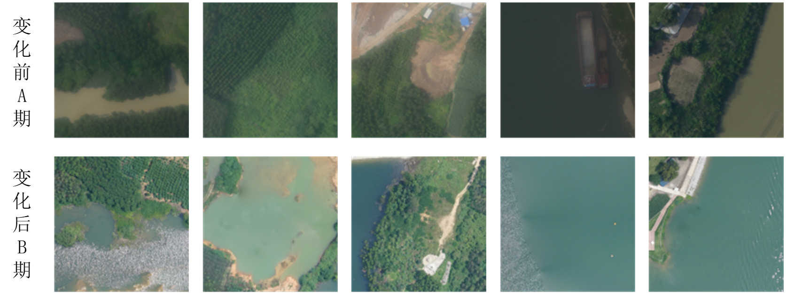

# 大型水利变化检测数据集DTX-CD

## 1. 数据集简介
本数据包含了华南地区大规模户外水利场景的高分辨率遥感影像数据，采集了华南地区多个堤防、水库等流域对应场景下的无人机影像数据，这样的数据集将被用于训练和测试项目的变化检测算法，以实现对水利工程周边环境的准确监测和分析。

其中数据集制作方面，根据国标 GBT 20257.1-2017 基本比例尺地图图式，结合水利领域工程实践实际，确定了8个主要变化检测地物类别，其中类别如下：

| 类别ID | 0 | 1 | 2 | 3 | 4 | 5 | 6 | 7 | 8 |
|:------:|:--:|:--:|:--:|:--:|:--:|:--:|:--:|:--:|:--:|
| 类别名称 | 背景 | 林地 | 草地 | 建筑物 | 船舶 | 道路 | 裸地 | 水域 | 其他 |

本数据集聚焦水利工程周边环境变化监测，通过高分辨率遥感影像捕捉堤防、水库等关键设施的动态变化。这对及时发现水利设施风险隐患、评估周边环境影响、制定防汛抗旱预案具有重要意义，可有效提升水利工程的智能化管理和预警能力。

## 2. 数据集特点

（1）类别丰富。如上表所示，本数据集包含9个主要类别，基本覆盖了水利设施周边的主要地物要素，如建筑、道路、水域、植被等。这些类别的设置既符合水利工程实际需求，也满足了变化检测任务的分析要求。

（2）覆盖范围广、数据量大。本数据集采集了华南地区多个典型水利设施场景的高分辨率遥感影像，包括水库、堤防、水利枢纽等重点区域。数据采集时间跨度合理，变化情况丰富，能够有效支持变化检测算法的开发和验证。

（3）真实场景数据，标注精确。数据来源于实际水利工程的无人机航拍影像，具有真实性强、实用价值高的特点。数据集采用专业人工标注，确保了标注质量，并经过多轮核验，为算法研究提供了可靠的训练数据。作为专门面向水利工程的变化检测数据集，可为水利设施的智能化监管提供有力的数据支持。

## 3. 数据集下载
通过网盘分享的文件：DTX-CD.zip
链接: https://pan.baidu.com/s/11DeXbS8qiYtaFPuX28uIog 提取码: ybh1

## 4. 数据集使用须知

### 4.1 引用说明
如果您在研究中使用了本数据集，请点击本项目右侧的`Cite this repository`进行引用。

### 4.2 使用协议
本数据集基于知识共享署名-非商业性使用-相同方式共享 4.0 国际 (CC BY-NC-SA 4.0) 协议授权使用。

您可以自由地：
- 共享 — 在任何媒介以任何形式复制、发行本作品
- 演绎 — 修改、转换或以本作品为基础进行创作

惟须遵守下列条件：
- **署名** — 您必须给出适当的署名，提供指向本许可协议的链接，同时标明是否作了修改。
- **非商业性使用** — 您不得将本作品用于商业目的。
- **相同方式共享** — 如果您再混合、转换或者基于本作品进行创作，您必须基于与原先许可协议相同的许可协议分发您贡献的作品。

### 4.3 联系方式
如果对数据集有任何问题，欢迎联系：zhou_wei@xtu.edu.cn
